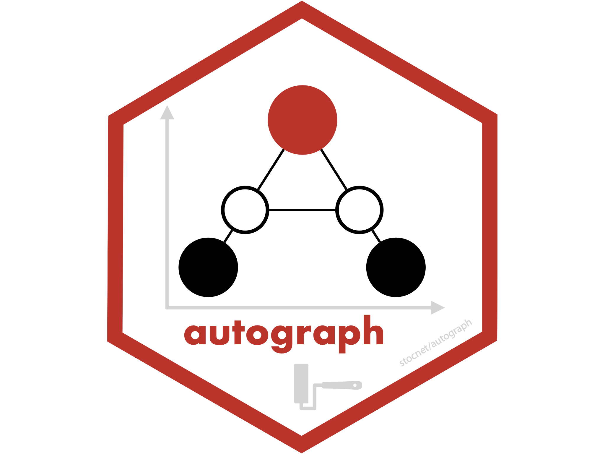
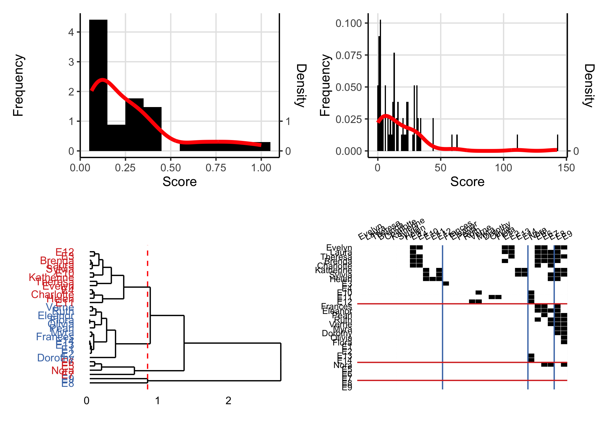
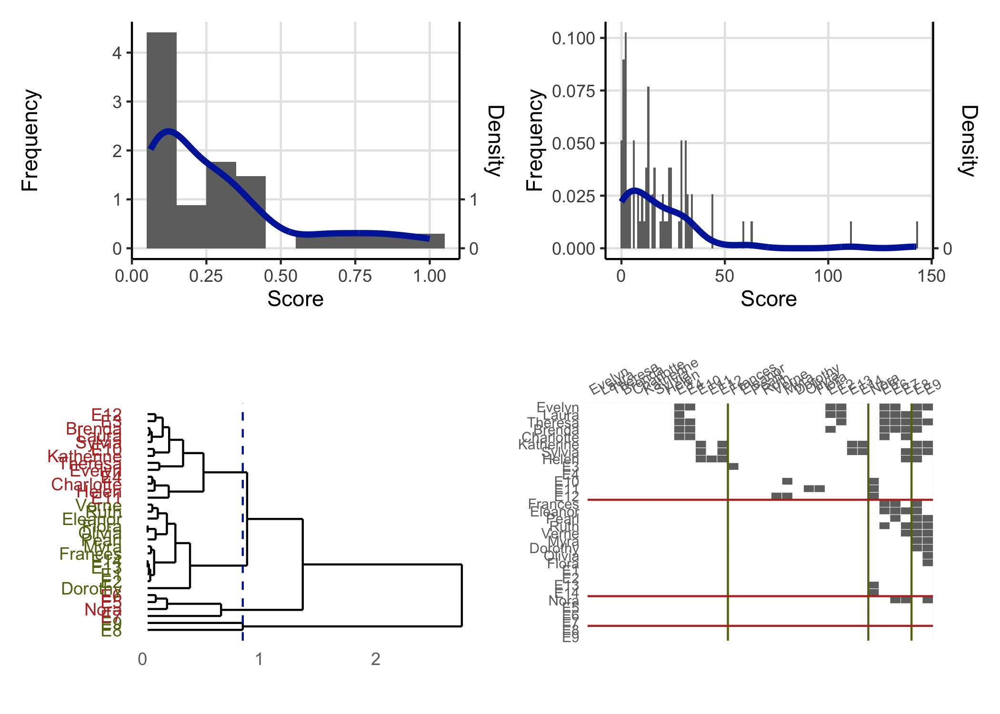

<!-- README.md is generated from README.Rmd. Please edit that file -->

# autograph



<!-- badges: start -->

[](https://lifecycle.r-lib.org/articles/stages.html#maturing)
 

[](https://app.codecov.io/gh/stocnet/autograph?branch=main)
<!-- [](https://www.codefactor.io/repository/github/stocnet/manynet) -->
<!-- [](https://bestpractices.coreinfrastructure.org/projects/4559) -->
<!-- [](https://doi.org/10.5281/zenodo.7076396) -->
<!-- see https://zenodo.org/record/7076396 -->
<!--  -->
<!-- badges: end -->

## About the package

This package aims to make exploration, analysis, and publication of
results from any of the stocnet packages easier, faster, and more
consistent. It does this by letting you simply set a theme, say for your
institution, and then those palettes will be used whenever you use
`plot()` or `graphr()` on an object created in one of the relevant
packages.

## Setting a theme

It is very easy to set a theme. Just type `stocnet_theme()` to see which
is the theme currently set, and to get a list of available themes. Then
enter the chosen theme name in

``` r
library(autograph)
library(patchwork)
stocnet_theme()
#> ℹ Theme is set to default.
#> ℹ The following themes are available: default, bw, iheid, ethz, uzh, rug, unibe, crisp, neon, and rainbow.
(plot(node_degree(ison_karateka)) + 
plot(tie_betweenness(ison_karateka)))/
(plot(node_in_regular(ison_southern_women, "e")) + 
plot(as_matrix(ison_southern_women),
     membership = node_in_regular(ison_southern_women, "e")))
```



``` r
stocnet_theme("ethz")
#> ✔ Theme set to ethz.
(plot(node_degree(ison_karateka)) + 
plot(tie_betweenness(ison_karateka)))/
(plot(node_in_regular(ison_southern_women, "e")) + 
plot(as_matrix(ison_southern_women),
     membership = node_in_regular(ison_southern_women, "e")))
```



## Installation

### Stable

The easiest way to install the latest stable version of `{autograph}` is
via CRAN. Simply open the R console and enter:

`install.packages('autograph')`

`library(autograph)` will then load the package and make the data and
tutorials (see below) contained within the package available.

### Development

For the latest development version, for slightly earlier access to new
features or for testing, you may wish to download and install the
binaries from Github or install from source locally. The latest binary
releases for all major OSes – Windows, Mac, and Linux – can be found
[here](https://github.com/stocnet/autograph/releases/latest). Download
the appropriate binary for your operating system, and install using an
adapted version of the following commands:

- For Windows:
  `install.packages("~/Downloads/autograph_winOS.zip", repos = NULL)`
- For Mac:
  `install.packages("~/Downloads/autograph_macOS.tgz", repos = NULL)`
- For Unix:
  `install.packages("~/Downloads/autograph_linuxOS.tar.gz", repos = NULL)`

To install from source the latest main version of `{autograph}` from
Github, please install the `{remotes}` package from CRAN and then:

- For latest stable version:
  `remotes::install_github("stocnet/autograph")`
- For latest development version:
  `remotes::install_github("stocnet/autograph@develop")`

### Other sources

Those using Mac computers may also install using Macports:

`sudo port install R-autograph`

## Funding details

Development on this package has been funded by the Swiss National
Science Foundation (SNSF) [Grant Number
188976](https://data.snf.ch/grants/grant/188976): “Power and Networks
and the Rate of Change in Institutional Complexes” (PANARCHIC).
