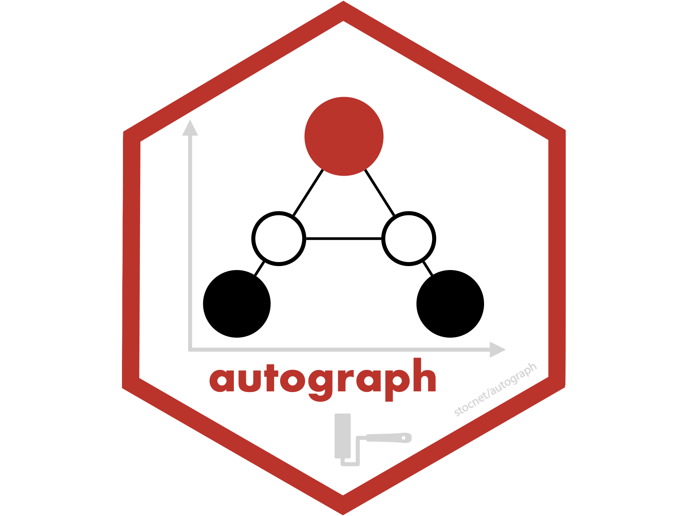
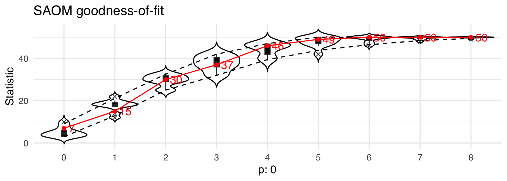
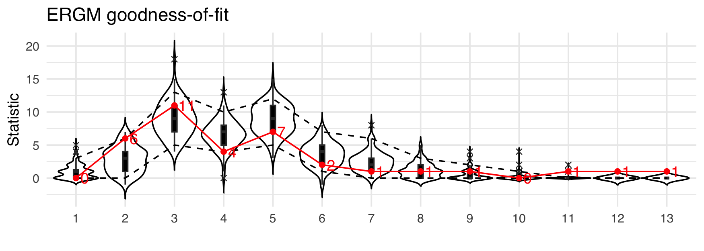
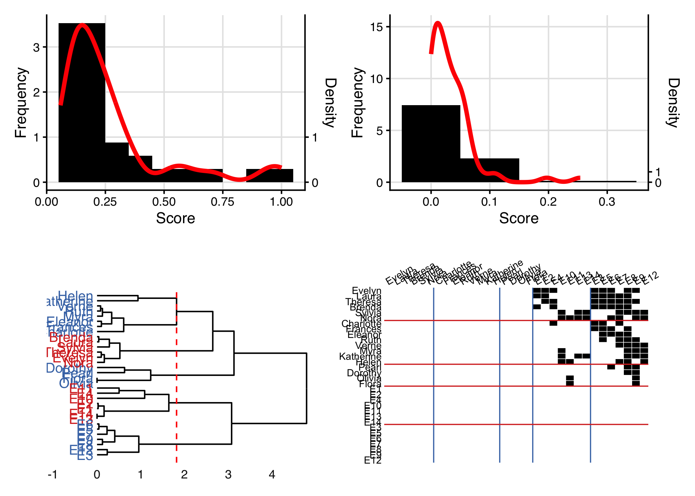
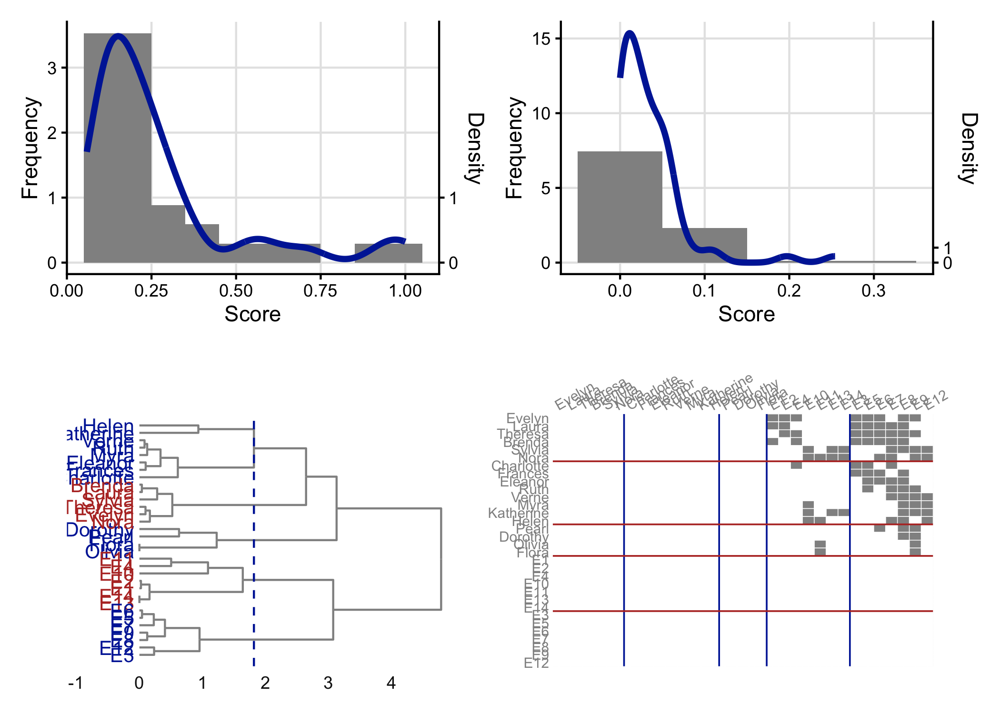
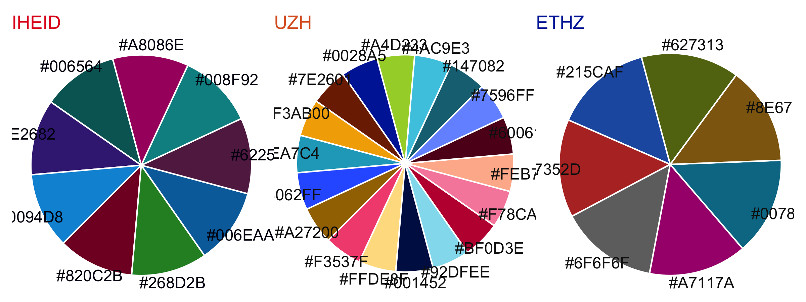
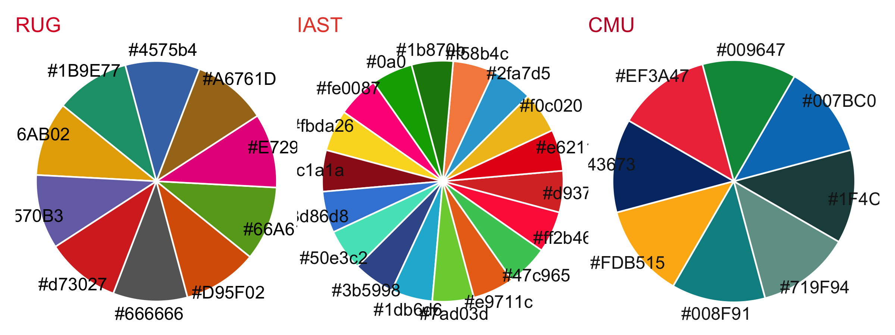
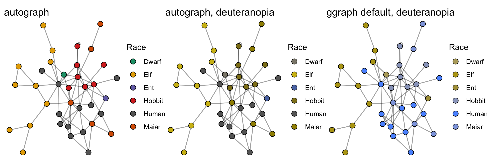

<!-- README.md is generated from README.Rmd. Please edit that file -->

# autograph 

<!-- badges: start -->

[](https://lifecycle.r-lib.org/articles/stages.html#maturing)
 

[](https://app.codecov.io/gh/stocnet/autograph?branch=main)
<!-- [](https://www.codefactor.io/repository/github/stocnet/manynet) -->
<!-- [](https://bestpractices.coreinfrastructure.org/projects/4559) -->
<!-- [](https://doi.org/10.5281/zenodo.7076396) -->
<!-- see https://zenodo.org/record/7076396 -->
<!--  -->
<!-- badges: end -->

## About the package

This package aims to make network visualisation *easier*, *succinct*,
and *consistent*. Visualisation is a key part of the research process,
from the initial exploration of data to the analysis of results and the
presentation of findings in publications. However, it is often a tedious
and time-consuming task. Trying to wrangle these into a consistent style
for publication or presentation can be frustrating and requires a lot of
code. While there are a number of excellent packages for network
analysis in R, they each face several of the following challenges when
it comes to visualisation:

- defaults are often not sensible for different types of networks
- customisation can sometimes be difficult
- some require multiple lines of code to even produce a graph or plot
- most require multiple lines of code to produce a graph or plot that is
  styled suitable for publication or presentation
- such style code needs to be repeated every time a graph or plot is
  produced if a consistent style is to be maintained
- defaults and syntax are different for different packages, so a
  workflow using multiple packages must adapt to multiple syntaxes
- different visual defaults can frustrate interpretation, and
  potentially invites errors when comparing plots from different
  packages
- some plotting methods are available for some networks or
  network-related results and not others

`{autograph}` aims to solve these problems by providing automatic graph
drawing for networks in any of the `{manynet}` formats, and automatic
plotting for results from `{stocnet}` packages, including `{migraph}`,
`{RSiena}`, and `{MoNAn}`, and more.

All you need to do is install the package (loading it last will make
sure its plotting methods are the default), use `set_stocnet_theme()`
(once) to set your preferred theme, and then use `graphr()` to graph
your networks, or `plot()` to plot your results. That’s it!

## Drawing graphs

`{autograph}` includes three one-line graphing functions with sensible
defaults based on the network’s properties.

First, `graphr()` is used to graph networks in any of the `{manynet}`
formats. Because it builds upon `{manynet}`, it can graph networks in
any of the `{manynet}` formats, including `network`, `igraph`, `sna`,
`tidygraph`, and more.

Second, it includes sensible defaults so that researchers can view their
network’s structure or distribution quickly with a minimum of fuss.
Compare the output from `{autograph}` with a similar default from
`{igraph}`:


`{igraph}` requires the bipartite layout to be specified, has cumbersome
node size defaults for all but the smallest graphs, and labels also very
often need resizing and adjustment to avoid overlap. Getting this
default plot to look good can take a lot of trial and error, and time.
By contrast, `graphr()` recognises the network as two-mode and uses a
bipartite layout by default. It also recognises that the network
contains names for the nodes and prints them vertically so that they are
legible in this layout. Other ‘clever’ features include automatic node
sizing and more.

This inference matters for more than tidiness. Where a default does not
recognise a property of the network, that property is usually dropped
silently. Compare the same signed network drawn by each package:


`irps_tribes` records both alliance and antagonism between sixteen
tribes, in equal number. `{igraph}` draws all of these ties identically,
so the distinction that motivates the data is not visible. `graphr()`
recognises the network as signed and maps the sign to both colour and
linetype, with a legend. The same applies to weights, to self-ties, and
to direction: `graphr()` reads these from the network rather than
requiring you to know to ask for them.

### More options

All of `graphr()`’s adjustments can be overridden, however… Changing the
size and colors of nodes and ties is as easy as specifying the
function’s relevant argument with a replacement,
e.g. `node_color = "darkblue"` or `node_size = 6`, or indicating from
which attribute it should inherit this information,
e.g. `node_color = "Office"` or `node_size = "Seniority"`.


Legends are added by default when node or tie aesthetics are mapped to
attributes, but can be removed with `show_legend = FALSE`. Since the
`{autograph}` builds upon `{ggplot2}`, titles, subtitles and, for
plotting, axis labels can all be added on easily, or other elements
(e.g. font size) can be tweaked for a particular output.

### More layouts

`graphr()` can use all the layout algorithms offered by packages such as
`{igraph}`, `{ggraph}`, and `{graphlayouts}`. `{autograph}` also offers
some additional layout algorithms for visualising partitions
horizontally, vertically, or concentrically, conforming to
configurational coordinates, or for snapping these layouts to a grid.


### More networks

The second graph drawing function included, `graphs()`, is used to graph
multiple networks together. This can be useful for ego networks or
network panels. `{patchwork}` is used to help arrange individual plots
together, and is used throughout the package to help arrange plots
together informatively.

`graphs()` computes one layout and holds it across every panel. Plotting
each network separately gives each panel its own layout, so a node can
appear in a different position in each panel even where nothing about
that node has changed. Holding the layout constant makes the panels
comparable, so that what moves on the page is what changed in the data.
`graphs()` also collects a single legend for the whole set.


### More time

The third graph drawing function, `grapht()`, is used to visualise
dynamic networks. It uses `{gganimate}` and `{gifski}` to create a gif
that visualises network changes over time, with node positions
transitioning smoothly between waves and nodes fading in and out as they
enter and exit the network. It really couldn’t be easier.


<!-- provide a common set of tools that can be used to import, export, create, and manipulate network data in a wide variety of formats, -->

<!-- and obtain a good first visualisation quickly. -->

<!-- This can be useful for pedagogical purposes, initial description, or checking something part way through the modelling process. -->

<!-- Through the most comprehensive network class-coercion available, -->

<!-- users can access routines not available in their chosen package or even in `{manynet}`. -->

<!-- `{manynet}` provides a common set of tools and a standard syntax for analysing many different types of networks. -->

<!-- It offers a broad range of functions to make, manipulate, map, measure, and model: -->

<!-- - one-, two-, and sometimes three-mode networks -->

<!-- - undirected, directed, and sometimes complex networks -->

<!-- - unweighted, weighted, and sometimes signed networks -->

## Generating plots

Since network analysis involves not just drawing graphs, `{autograph}`
also provides a function for plotting results from the analysis or
modelling of those networks. To keep things simple, all users need to
remember is a single, generic function: `plot()`. Method dispatching
takes care of the rest, so you can concentrate on exploring and
interpreting your results.

Dispatching works because the results carry a class. `igraph::degree()`
and `sna::degree()` each return a bare numeric vector, so `plot()` falls
back to a scatterplot of the values against their index, and that index
is not meaningful. `netrics::node_by_degree()` returns a `node_measure`,
which `{autograph}` plots as a themed distribution:


The same holds for the other result classes. Here are some further
examples, using goodness-of-fit results from fitting a SAOM in
`{RSiena}` and an ERGM in `{ergm}`. (Note that neither the data nor the
model are similar; this is just for illustrative purposes.)



### Setting a theme

Note that in the above plots, the same colour scheme and fonts were
used. They can be easily changed though. `{autograph}` includes a number
of themes that can be used to style all graphs and plots consistently.
And it is very easy to set a theme. Just type `stocnet_theme()` to see
which is the theme currently set, and to get a list of available themes.
Then enter the chosen theme name in the function to set it. All plots
created using `{autograph}` functions will then use this theme, until
you change it again.

``` r
stocnet_theme()
(plot(netrics::node_by_degree(ison_karateka)) + 
plot(netrics::tie_by_betweenness(ison_karateka)))/
(plot(netrics::node_in_regular(ison_southern_women, "e")) + 
plot(as_matrix(ison_southern_women),
     membership = netrics::node_in_regular(ison_southern_women, "e")))
```



``` r
stocnet_theme("ethz")
(plot(netrics::node_by_degree(ison_karateka)) + 
plot(netrics::tie_by_betweenness(ison_karateka)))/
(plot(netrics::node_in_regular(ison_southern_women, "e")) + 
plot(as_matrix(ison_southern_women),
     membership = netrics::node_in_regular(ison_southern_women, "e")))
```



There are a range of institutional and topical themes available,
including default, bw, crisp, neon, clay, iheid, ethz, uzh, rug, unibe,
oxf, unige, cmu, iast, hwu, rainbow, with more on the way.



### Colours everyone can read

About one man in twelve, and one woman in two hundred, sees colour
differently. A palette that separates its categories for most readers
can collapse for them, and the classic offender is the red-green pair
that so many palettes hold.

`{autograph}` does something about this without asking you to give up a
palette. Every theme’s categorical palette is reordered when the theme
is set, so that the colours a graph reaches for first are those that
stay distinct under each type of colour blindness, and each divergent
palette pairs a warm pole with a cool one.

`simulate_colorblind()` shows a set of colours as another viewer sees
them, so mapping the simulated colours back onto a graph shows you their
view of it. Here is the same network three times: in `{autograph}`’s
default palette as most readers see it, then as a reader with
deuteranopia does, and then in the palette `{ggraph}` falls back on when
`{autograph}` is not setting the colours, as that same reader sees it.

``` r
set_stocnet_theme("default")
as_seen <- function(colours, type, title){
  graphr(fict_lotr, node_colour = "Race", node_size = 3, labels = FALSE) +
    ggplot2::scale_fill_manual(values = simulate_colorblind(colours, type)) +
    ggtitle(title)
}
as_seen(ag_qualitative(6), "normal", "autograph") |
  as_seen(ag_qualitative(6), "deutan", "autograph, deuteranopia") |
  as_seen(scales::hue_pal()(6), "deutan", "ggraph default, deuteranopia")
```



The six races remain tellable apart in the middle panel, its closest
pair being Hobbits and Maiar. In the right-hand one, Elves and Ents have
become the same olive. `contrast_colors()` puts a number on it, scoring
how far apart colours are at their worst across normal vision and each
type of colour blindness:

``` r
round(min(contrast_colors(ag_qualitative(6)), na.rm = TRUE), 1)             # autograph
#> [1] 13.5
round(min(contrast_colors(scales::hue_pal()(6)), na.rm = TRUE), 1)          # ggraph
#> [1] 5.5
round(min(contrast_colors(igraph::categorical_pal(6)), na.rm = TRUE), 1)    # igraph
#> [1] 16.2
```

Below 10 two colours are easily confused, above 25 they are comfortably
distinct. `{igraph}`’s categorical palette is the Okabe-Ito scheme,
which was designed for this and scores accordingly: where you are free
to choose any colours at all, such a scheme is hard to beat, and
`graphr()` will happily take it. The harder case is the one
`{autograph}` is built for — colours chosen by somebody else, for
reasons that were not legibility — and there the ordering is what stands
between a brand palette and an unreadable graph. A palette with more
colours to draw on has more room to gain: six categories score 29 under
the `"hwu"` theme and 26 under `"oxf"`.

If your institution or organisation is not included and you would like
it to be, please just raise an issue on Github, along with a link to
your corporate branding or style guide if available, and we will attempt
to add it at the next opportunity.

In sum, while there is a lot of clever defaults and customisation
available, all it takes is three simple functions for your

## Installation

### Stable

The easiest way to install the latest stable version of `{autograph}` is
via CRAN. Simply open the R console and enter:

`install.packages('autograph')`

`library(autograph)` will then load the package and make the data and
tutorials (see below) contained within the package available.

### Development

For the latest development version, for slightly earlier access to new
features or for testing, you may wish to download and install the
binaries from Github or install from source locally. The latest binary
releases for all major OSes – Windows, Mac, and Linux – can be found
[here](https://github.com/stocnet/autograph/releases/latest). Download
the appropriate binary for your operating system, and install using an
adapted version of the following commands:

- For Windows:
  `install.packages("~/Downloads/autograph_winOS.zip", repos = NULL)`
- For Mac:
  `install.packages("~/Downloads/autograph_macOS.tgz", repos = NULL)`
- For Unix:
  `install.packages("~/Downloads/autograph_linuxOS.tar.gz", repos = NULL)`

To install from source the latest main version of `{autograph}` from
Github, please install the `{remotes}` package from CRAN and then:

- For latest stable version:
  `remotes::install_github("stocnet/autograph")`
- For latest development version:
  `remotes::install_github("stocnet/autograph@develop")`

### Other sources

Those using Mac computers may also install using Macports:

`sudo port install R-autograph`

## Funding details

Development on this package has been funded by the Swiss National
Science Foundation (SNSF) [Grant Number
188976](https://data.snf.ch/grants/grant/188976): “Power and Networks
and the Rate of Change in Institutional Complexes” (PANARCHIC).
